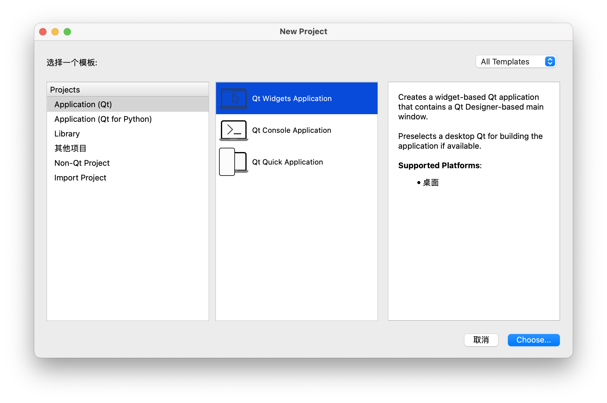
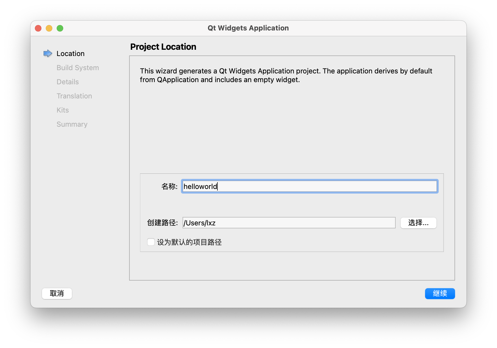
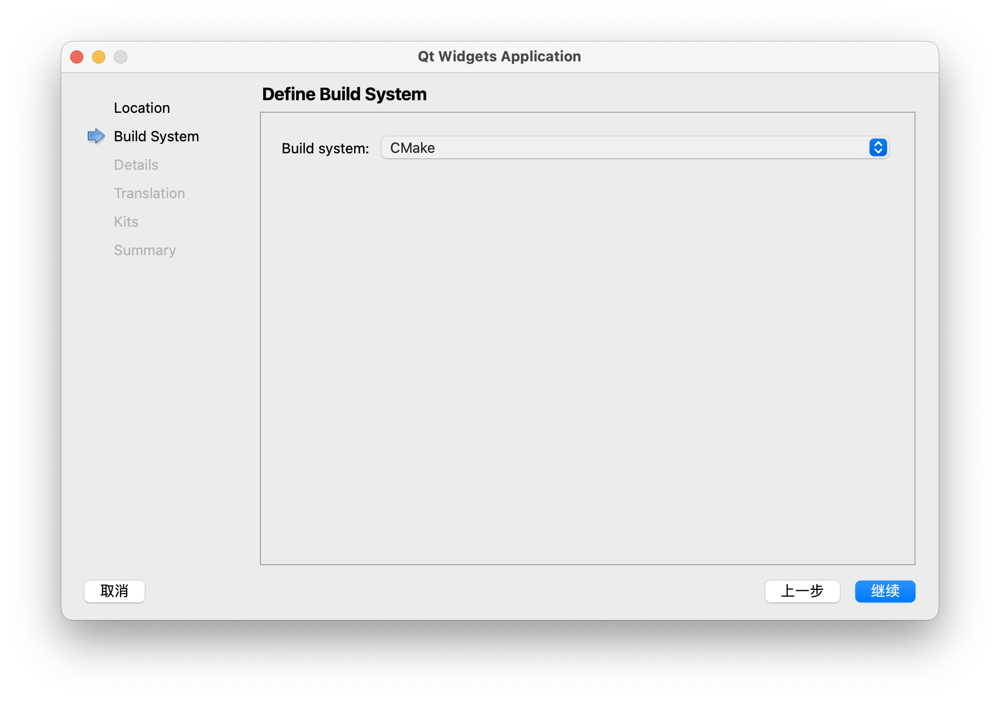
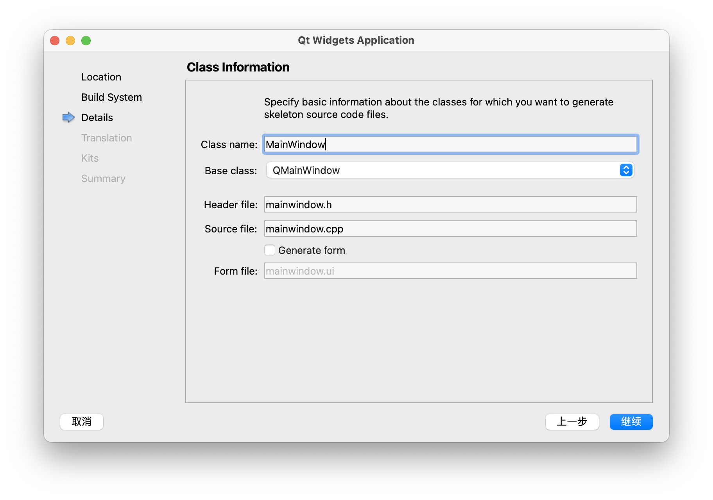
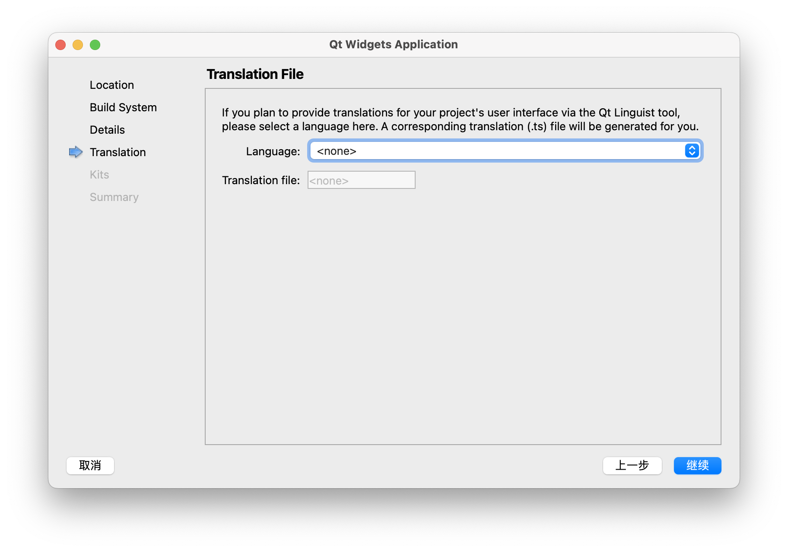
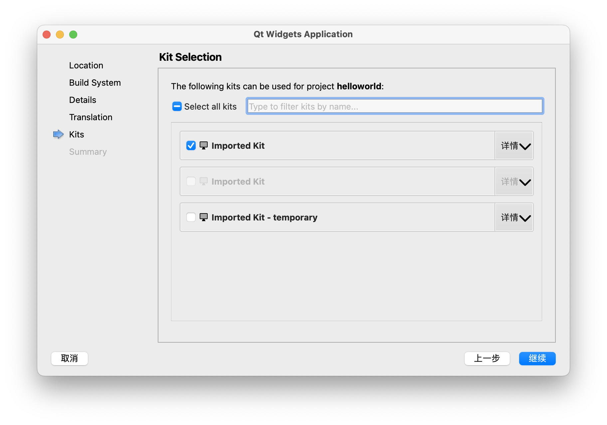
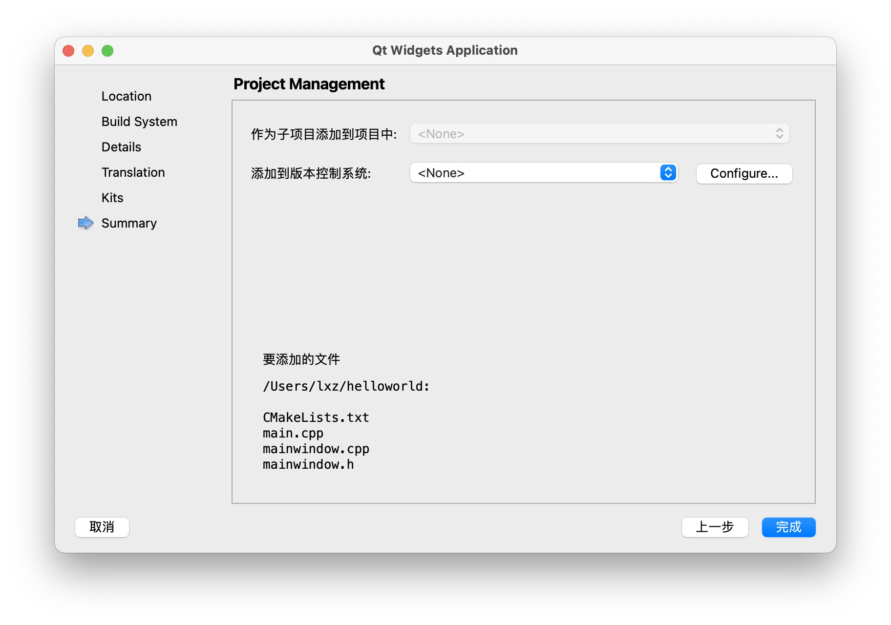
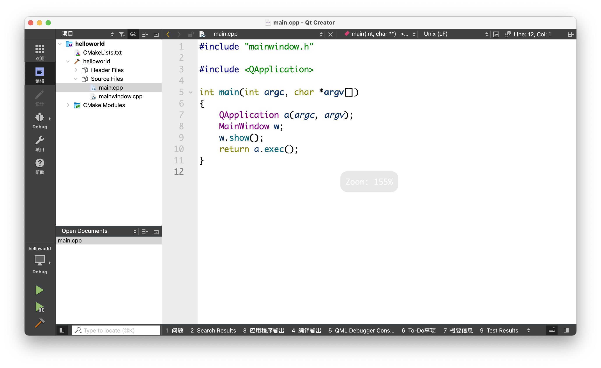

## 新建项目

启动 Qt Creator，新建一个项目，选择新建 `Qt Widgets Application`。

## 选择项目位置

选择项目的保存位置，这里选择的默认路径，并修改项目名为 `helloworld`。

## 构建系统

选择构建系统，默认使用 CMake。

> Qt6 已经全面采用 CMake 作为构建系统，当然我们也可以继续使用 QMake 作为构建工具。

## 配置默认窗口信息

Qt Creator 会帮我们自动新建一个 MainWindow 的类，并生成一份 mainwindow.ui 的文件作为界面。

在 Qt 中支持两种方式创建界面，一种是 ui 文件的描述结构，一种是在代码中通过命令的方式创建。

> ui 文件本质上也会编译成对应的 c++ 代码

在这里我们将会选择使用命令方式创建，所以取消了 `Generate form` 选项。

## 设置翻译

这里先跳过，后面会重新设置。

## 选择构建的工具包

kits 是包含了 Qt 版本及编译器等信息的合集，默认情况下，会帮我们自动创建一份，当然我们也可以调整出一份交叉编译的 kit 使用。

## 版本控制系统

可以选择项目的版本控制，默认不处理，可以手动基于 git 或者 svn 进行管理。

## 最终代码

经过上面的创建向导，我们已经新建出一份项目，通过这个向导可以节约我们很多时间，下一章将会介绍如何手动创建一个项目。

