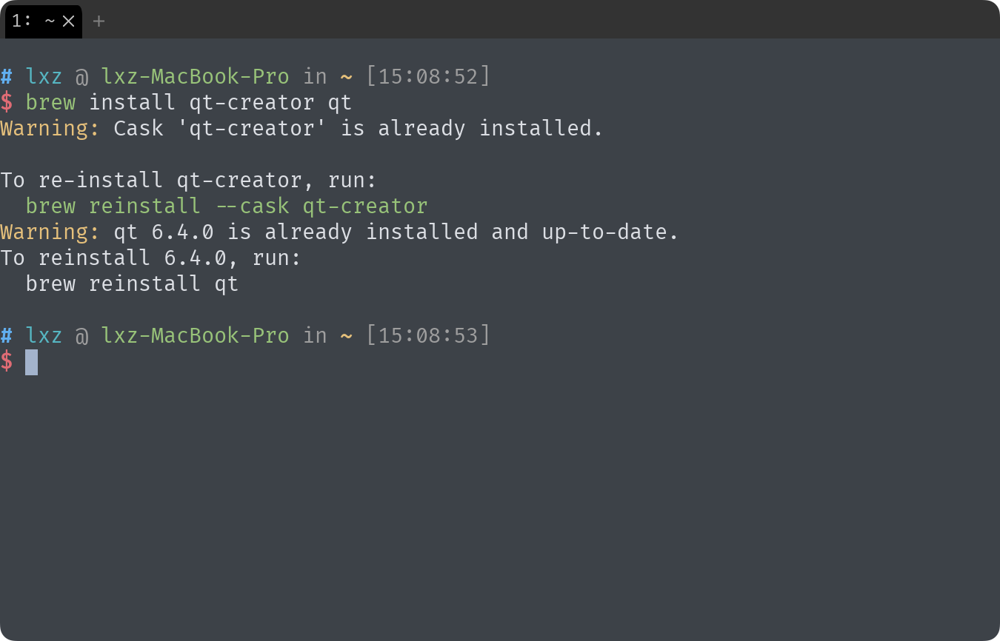

现在就让我们先安装好 Qt 吧！

不同的系统有不同的方式，本篇文章将会分别介绍他们的安装方式。

## macOS

macOS 下有两种安装方式，一种是在 qt  官网下载二进制安装包，另一种是使用 homebrew 进行安装。

### 二进制安装包

> TODO: missing doc

### homebrew

首先执行命令安装 homebrew

```shell
/bin/bash -c "$(curl -fsSL https://raw.githubusercontent.com/Homebrew/install/HEAD/install.sh)"
```

完成安装后，使用 brew 命令安装 Qt

```shell
brew install qt-creator qt
```



## Linux

Linux 下安装也可以分为二进制安装和仓库安装，通常我们建议使用仓库提供的，这样可以确保软件分发的兼容性，当然也可以自己完成分发，本篇文章不会详细讨论分发的过程。

### archlinux

```shell
sudo pacman -Sy qtcreator qt6
```

### deepin/debian/ubuntu

```shell
sudo apt update && sudo apt install qtcreator qt6-default
```

> TODO: 命令需要更新

## Windows

> TODO: missing doc